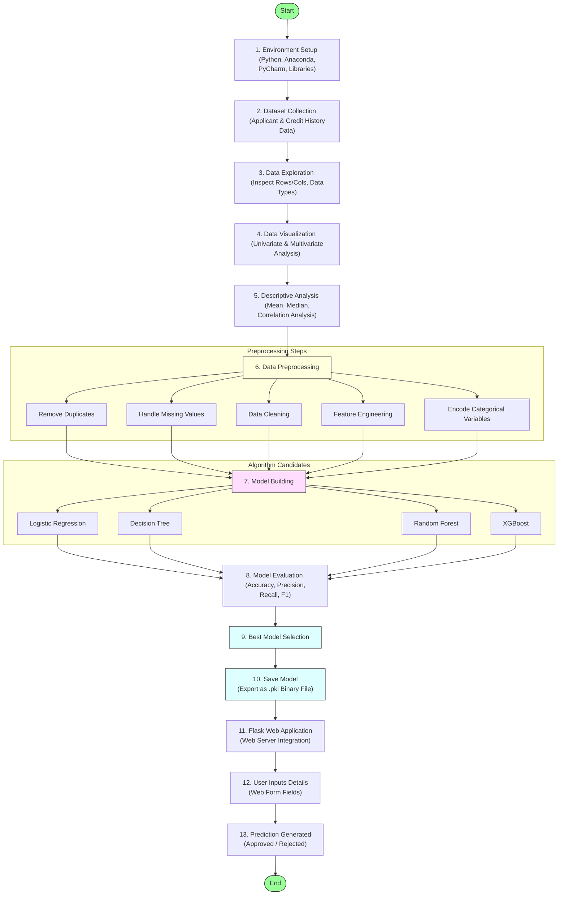
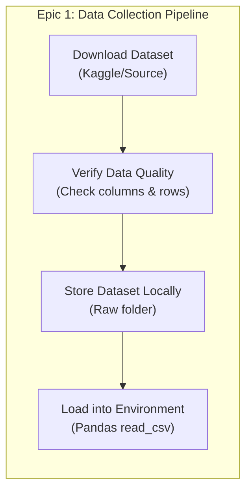
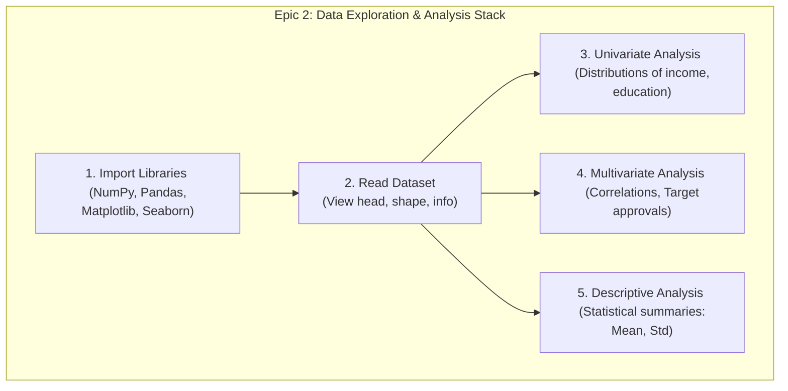
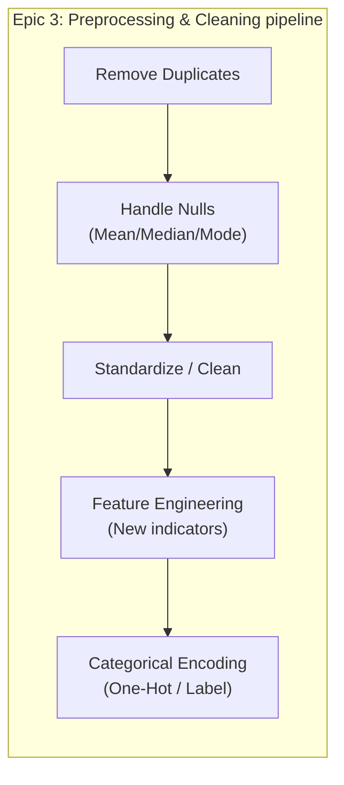
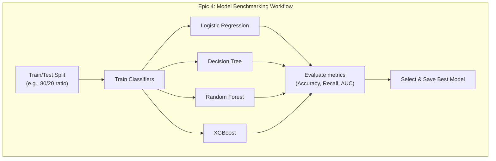
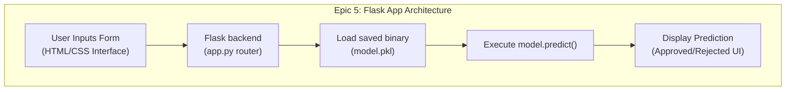

# Task 3 – Project Workflow

## Project Title

**Credit Card Approval Prediction Using Machine Learning**

---

# Objective

The objective of this task is to define the complete workflow of the Credit Card Approval Prediction project. The workflow describes each phase of the machine learning lifecycle, from data collection to application deployment, ensuring a systematic and organized development process.

---

# Introduction

The Credit Card Approval Prediction project follows a structured workflow to automate the process of predicting whether a credit card application should be approved or rejected. The project begins with collecting the dataset, followed by data analysis, preprocessing, feature engineering, model building, and finally deploying the best-performing model through a Flask web application.

A well-defined workflow ensures better project organization, improves model performance, and simplifies maintenance and deployment.

---

# Project Workflow Pipeline Diagram

---

# Detailed Epics & Stories

## Epic 1: Data Collection

### Story 1: Download the Dataset
* **Objective:** Collect the historical applicant dataset required for training and testing the machine learning models.
* **Activities:**
  * Download the applicant and credit record datasets.
  * Verify schema consistency.
  * Store the dataset files in the workspace.
  * Load datasets into the Python runtime environment.
* **Output:** Clean raw data available for structural analysis.

---

## Epic 2: Visualizing and Analysing the Data

### Story 1: Import Libraries
Set up Python notebook/script dependencies including NumPy, Pandas, Matplotlib, Seaborn, Scikit-learn, Flask, and XGBoost.

### Story 2: Read Dataset
Load the tables using Pandas, and check basic metadata attributes (row/column sizes, structural data types, null counts, target class balance).

### Story 3: Univariate Analysis
Analyze and visualize individual features using:
* Count plots for categorical columns (Income Type, Education, Housing Type, Employment).
* Histograms/Box plots for continuous numerical columns (Income, Age, Years Employed).

### Story 4: Multivariate Analysis
Inspect feature correlations and cross-feature distributions using:
* Correlation Matrix Heatmaps (detect multi-collinearity).
* Pair plots & Scatter plots (evaluate feature separation against target approval status).

### Story 5: Descriptive Analysis
Extract statistical attributes (mean, median, standard deviation, minimum, maximum, and correlation values) to build mathematical intuition about feature scale.

---

## Epic 3: Data Preprocessing

### Story 1: Remove Duplicate Records
Detect and drop identical record rows to eliminate bias in model training.

### Story 2: Handle Missing Values
Impute missing features using statistical measures (mean/median for numerical, mode for categorical) or drop columns with excessively high null values.

### Story 3: Data Cleaning
Format values (e.g., standardizing text inputs, removing anomalous employment years), select relevant columns, and join demographic files with credit score tables.

### Story 4: Feature Engineering
Create high-value predictors (e.g., Debt-to-Income Ratio, Employment Status duration flag, Credit Risk history category).

### Story 5: Encode Categorical Variables
Transform non-numerical string categories into mathematical formats using One-Hot Encoding (for nominal classes) and Label/Ordinal Encoding (for ordered classes).

---

## Epic 4: Model Building

### Story 1: Logistic Regression
Train a baseline Logistic Regression binary classifier to establish standard benchmark metrics.

### Story 2: Decision Tree
Build a Decision Tree model to inspect structural rules, feature splits, and classification trees.

### Story 3: Random Forest
Train an ensemble Random Forest model to reduce variance and improve prediction stability.

### Story 4: Model Comparison & Selection
Benchmark all candidate models across validation sets. Compare metrics:
* Accuracy & Precision
* Recall (Minimizing False Acceptances of risky applicants)
* F1-Score & ROC-AUC Curve
Select the model with the best validation recall/F1-score and save the output configuration.

---

## Epic 5: Application Building

### Story 1: Build HTML/CSS Pages
Develop a user-friendly interface using CSS styling to collect applicant variables (Income, Age, Education, Employment details).

### Story 2: Build Python Script
Write `app.py` script containing Flask application endpoints, parsing input values, scaling variables, running inference against the saved model file, and displaying results.

### Story 3: Run the Application
Perform verification tests to validate API payload routing, server start, and correct approved/rejected page displays.

---

# Workflow Summary Table

| Phase | Description |
| :--- | :--- |
| **Environment Setup** | Install required tools (Anaconda, PyCharm) and Python packages. |
| **Data Collection** | Download datasets and load them into Pandas DataFrames. |
| **Data Analysis** | Inspect dataset dimensions, statistics, and distributions. |
| **Data Preprocessing** | Remove duplicates, impute missing values, and standardize features. |
| **Feature Engineering** | Calculate derived indicators to improve model learning. |
| **Model Building** | Train Logistic Regression, Decision Tree, Random Forest, and XGBoost. |
| **Model Evaluation** | Compare performance metrics to pick the most accurate classifier. |
| **Deployment** | Save model as a `.pkl` binary and load it inside a Flask web application. |
| **Prediction** | Generate real-time approval results via the web interface. |

---

# Expected Outcome

Upon successful execution of the workflow:
* A structured dataset is cleaned, engineered, and prepared.
* Multiple classification models are trained, tuned, and evaluated.
* The optimal classifier is saved as a binary file.
* A Flask web application is deployed locally, enabling users to receive real-time approval/rejection predictions from the model.

---

# Conclusion

The Credit Card Approval Prediction project follows a systematic machine learning lifecycle. By transitioning sequentially through data exploration, cleaning, benchmarking, and frontend development, the workflow guarantees robust model metrics, a clean user experience, and a structured path to web deployment.
