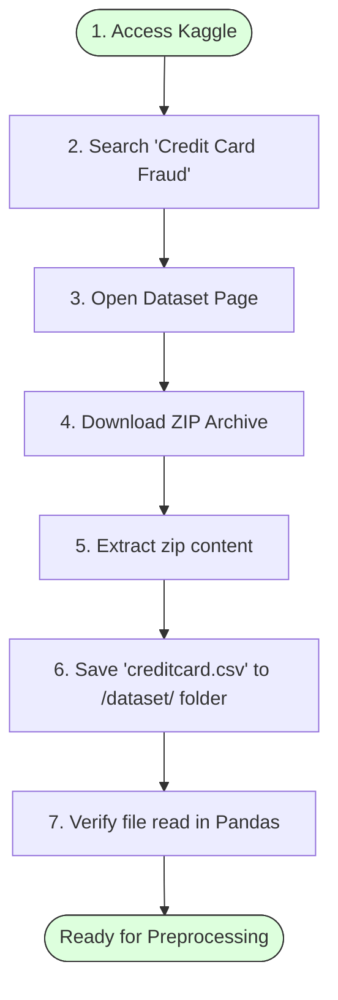
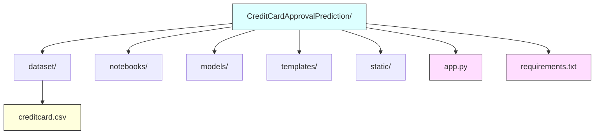

# Task 4 – Download the Dataset

## Project Title

**Credit Card Approval Prediction Using Machine Learning**

---

# Objective

The objective of this task is to collect the dataset required for developing the Credit Card Approval Prediction system. The dataset serves as the foundation for data preprocessing, feature engineering, visualization, model training, evaluation, and deployment.

---

# Introduction

Machine learning models require high-quality historical data for accurate prediction. For this project, the dataset is obtained from Kaggle, one of the world's largest repositories for machine learning datasets.

The selected dataset contains anonymized credit card transaction records, which are widely used for building fraud detection and approval prediction models. The data includes numerical features representing transaction characteristics and a target variable indicating whether a transaction is fraudulent or genuine.

The dataset is downloaded and stored locally before proceeding with preprocessing and model development.

---

# Dataset Source Details

* **Dataset Name:** Credit Card Fraud Detection Dataset
* **Source:** Kaggle
* **Dataset Link:** https://www.kaggle.com/datasets/mlg-ulb/creditcardfraud

---

# Dataset Description

The dataset contains anonymized credit card transaction data collected from European cardholders.

* **Total Records:** 284,807
* **Total Features:** 31
* **Target Variable:** `Class` (0 = Genuine Transaction, 1 = Fraudulent Transaction)

Most features are anonymized using Principal Component Analysis (PCA) to protect sensitive customer information.

### Dataset Attributes Table

| Attribute | Type | Description |
| :--- | :--- | :--- |
| **Time** | Numerical | Time elapsed between transactions (in seconds). |
| **V1 – V28** | Numerical | Principal Component Analysis (PCA)-transformed features. |
| **Amount** | Numerical | Transaction amount. |
| **Class** | Binary (0 / 1) | Target variable (0 = Genuine, 1 = Fraud). |

---

# Download & Preparation Flow

---

# Folder Structure Layout

---

# Tools Used

* **Kaggle** (Dataset Repository)
* **Web Browser** (Download Tool)
* **Python / Pandas** (Data Loading)
* **Anaconda Navigator / PyCharm** (Workspace Setup)

---

# Expected Outcome

After completing this task:
* The dataset is downloaded successfully.
* The file `creditcard.csv` is stored in the `/dataset/` directory.
* The data is ready for exploration and preprocessing.
* The environment is fully prepared for machine learning model development.

---

# Conclusion

The Credit Card Fraud Detection dataset was successfully downloaded from Kaggle and prepared for further analysis. This dataset serves as the primary source for preprocessing, visualization, feature engineering, model training, and deployment of the Credit Card Approval Prediction system.
